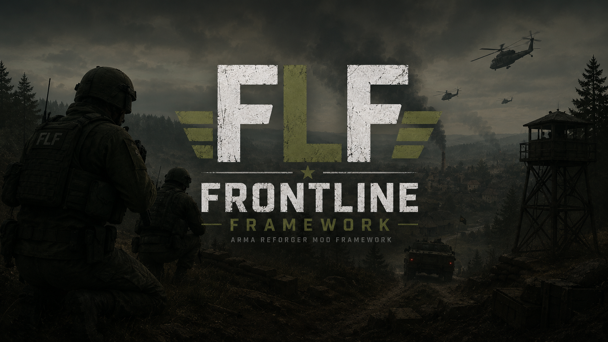

# ⚔️ FrontLine Framework
### Arma Reforger — Conflict PvE Framework

<p align="center">
  
</p>


---

## 📖 Overview

**FrontLine Framework** is a cooperative PvE scenario for Arma Reforger built on the base Everon map. Players work together against an AI-controlled enemy force in a frontline-style conflict where territory control, supply logistics, and base fortification determine the outcome of the battle.

This repository serves as the **official documentation and progress tracking hub** for the mod's development.

---

## 🎯 Objective

- **Win:** Capture the Enemy Main HQ.
- **Lose:** Allow the Enemy to capture the Player Main HQ.

---

## ✨ Core Features

| Feature | Description |
|---|---|
| 🎲 Dynamic Start | Player starting base is randomly selected at match start |
| 📡 Radio Signal Links | Bases project a signal radius — only connected points can be contested |
| 🚩 Capture Points | Territory control with reactive enemy counter-attacks |
| 📦 Supply Depots | Passively generate supplies; friendly AI trucks haul resources to HQ |
| 🛠️ Fortification System | Spend supplies to fortify bases with defences |
| 📞 Support Systems | Call in artillery, CAS, reinforcements and more via HQ Terminal |
| 🦾 Enemy AI | Reactive AI that only pushes actively contested capture points |
| 🏆 Win / Lose Conditions | HQ capture determines the outcome |

---

## 📁 Documentation Structure

```
docs/
├── design/           # Feature design documents
├── scripting/        # EnforceScript reference and patterns
└── setup/            # Workbench and mod setup guides
ROADMAP.md            # Phase-by-phase development plan
CHANGELOG.md          # Version history and change log
CONTRIBUTING.md       # Contribution guidelines
LICENSE               # Mod license
```

---

## 🗺️ Map

This scenario is built exclusively on the **vanilla Everon map** included with Arma Reforger. No terrain mods are required.

---

## 🚧 Development Status

See [ROADMAP.md](./ROADMAP.md) for the full phase-by-phase development plan and current progress.

See [CHANGELOG.md](./CHANGELOG.md) for a log of all changes made during development.

---

## 📜 License

See [LICENSE](./LICENSE) for usage and distribution terms.

---

> *Documentation and mod developed by [@BushCoda](https://github.com/BushCoda)*
